# Fourier_Transform_image_Processing
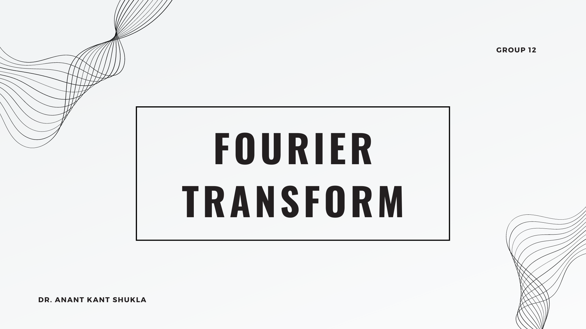
This repository tells you about uses of Fourier Transform in the Image -processing.

In this code, I am removing Low Frequencies in the image (i.e White Coloures Lotus) and converting the whole Image in a High frequency Image.
Change of the array can be seen in the last portion of this code.

## Theoritical Concepts about Fourier Transforms
About Our Team

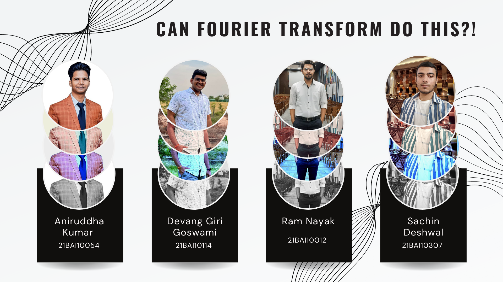

### Contents of the Read.md

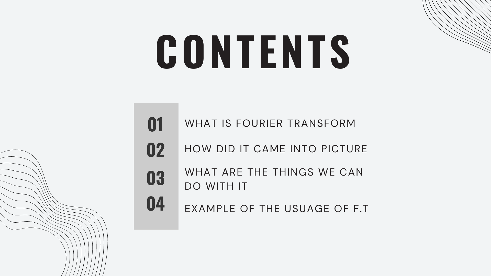

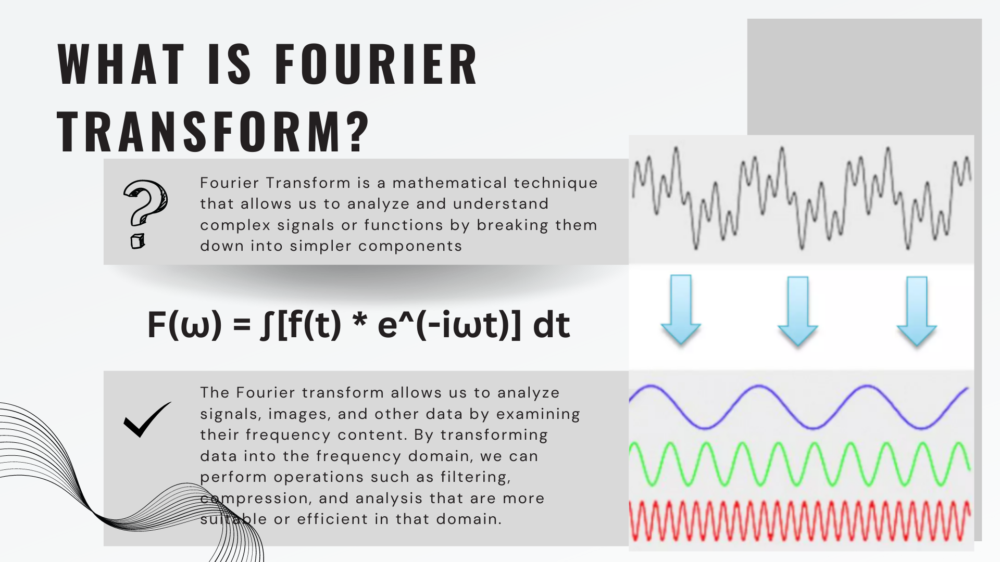
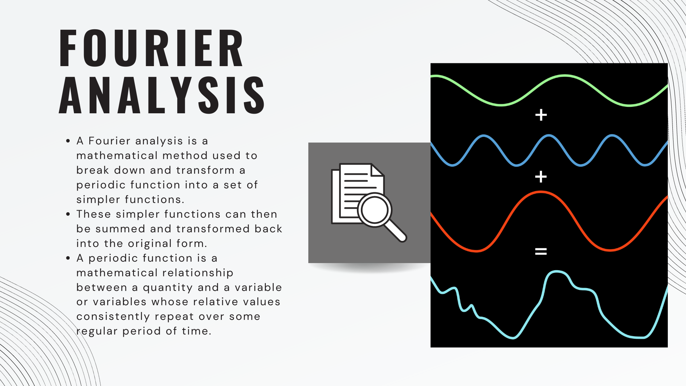
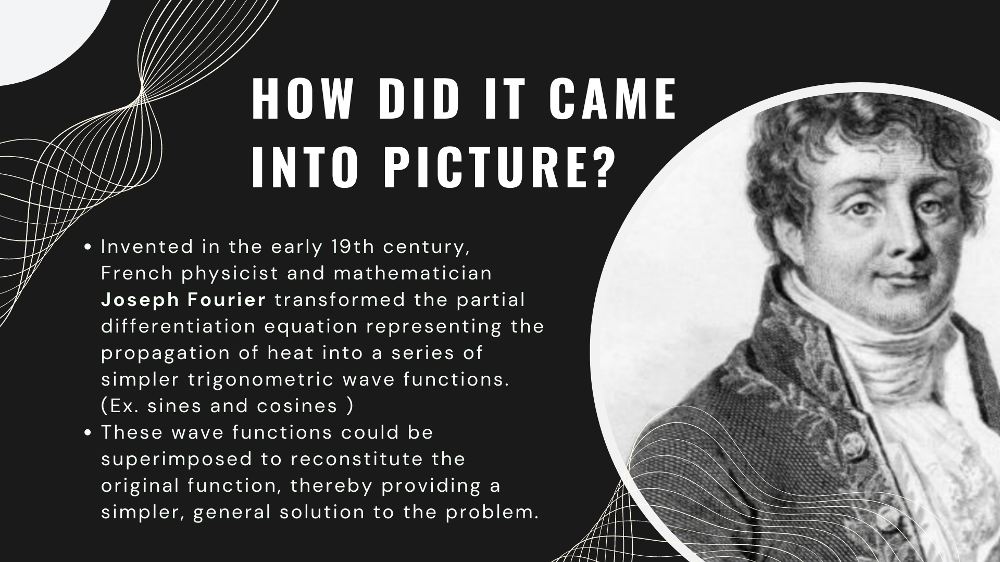
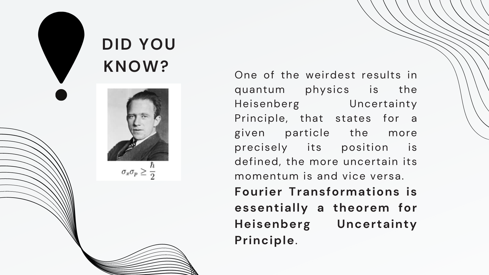
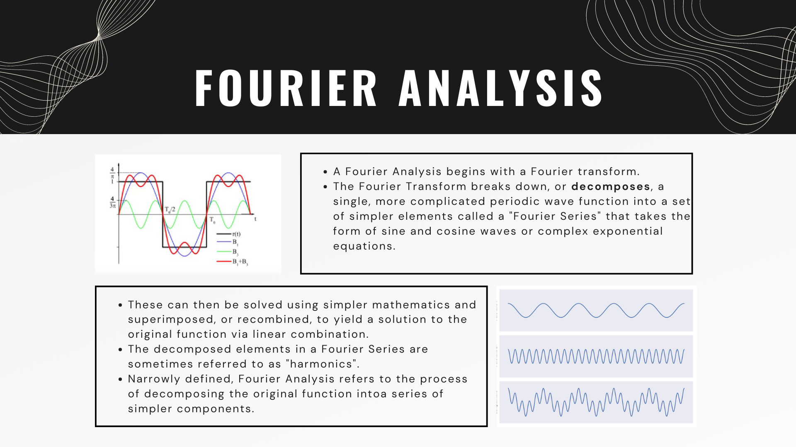

### Other Uses of Fourier Transforms

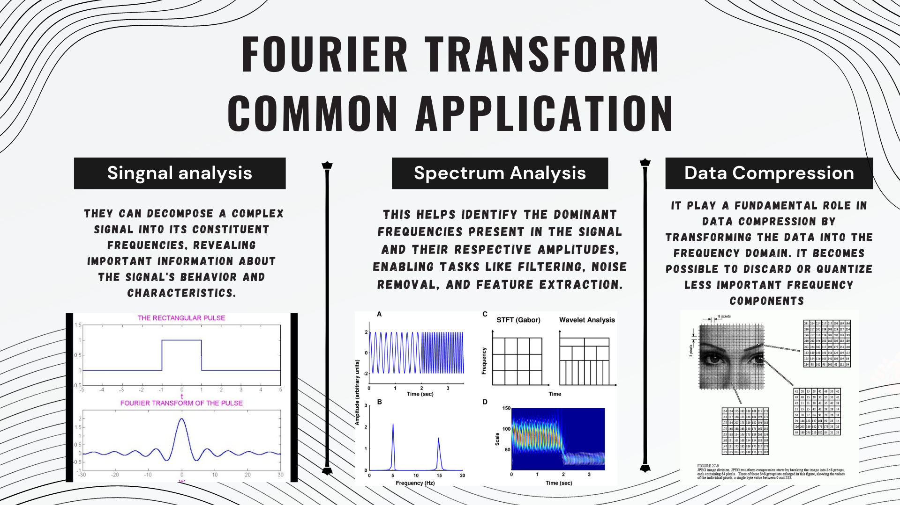
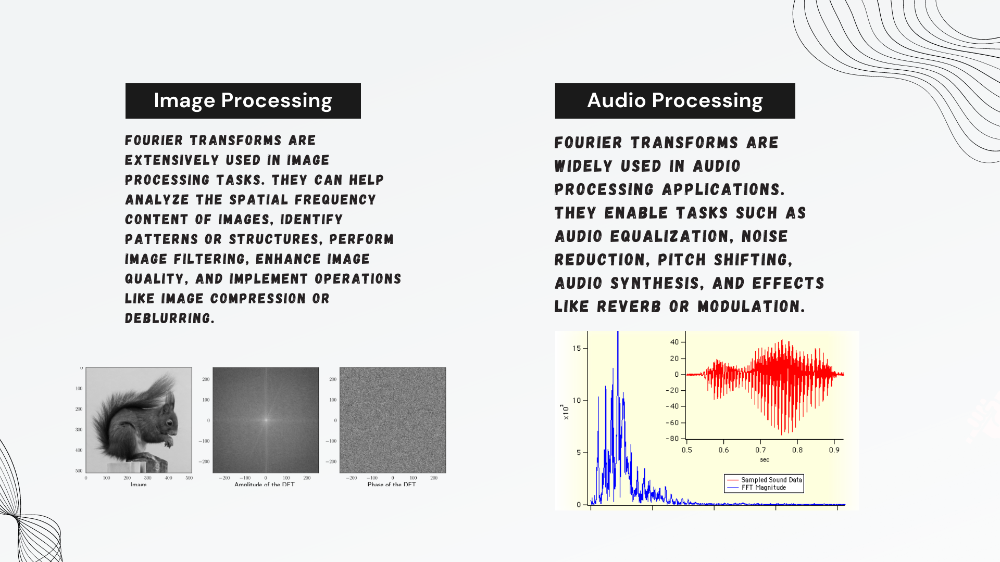

### Now you can refer the Code-Book

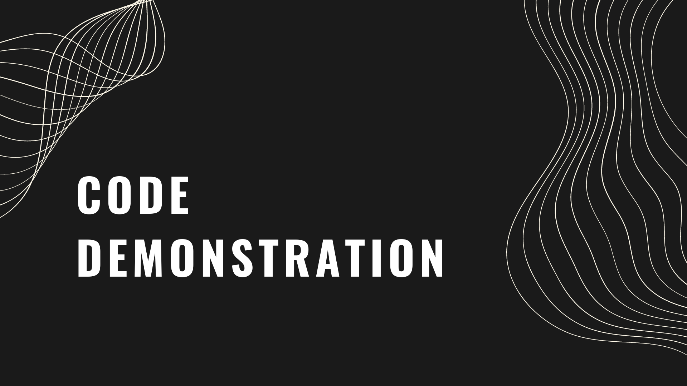

## Thank you
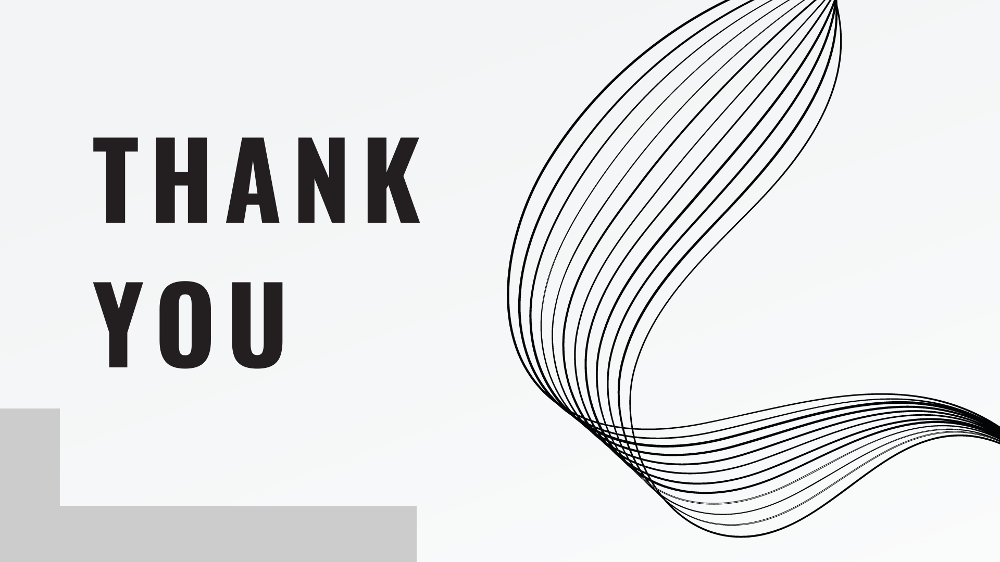
